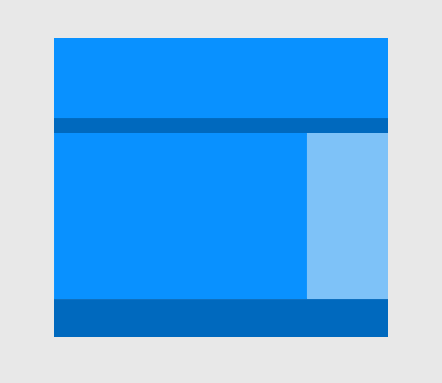
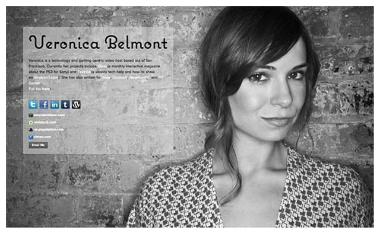

# Week 1 Day 3: HTML & CSS - Putting it all together

### Layout Walkthrough

For this walkthrough, we're going to draw out a website on paper and then proceed to plan out our HTML structure and plans to use CSS to accomplish the finished website.



1. Draw this layout on paper and label it with any ids or classes you think you might want to use to pull it off.

2. Start a new HTML file and build out your HTML structure.

3. Create a new CSS file and link it to your HTML file.

4. Define the selectors you'd like to style. IE: header, etc.

```css
#header {
  /* your css */
}
```

5. Add properties and values to the selectors to achieve the same layout as shown above. Hint: You can use `background-color` to allow you to see the boundaries of each element while you are building them.

### HTML & CSS Project
For this project, you're going to build your own profile page that can serve as the beginnings of your web development portfolio.

You can design your page to look any way you'd like but for the purpose of exercising the concepts covered, please use all of the following in your page.

Create a new document called `profile.html` to serve as your profile page

For content, please include:  
* Your name
* Include a professional photo of yourself
* Link to your Github profile that we created in our first class
* A list or table of your projects. We don't have any web projects built yet but go ahead and add this course as your first project and we can replace it later.
* Link to any other professional profiles such as LinkedIn or Twitter

For styling, your page must:
* Use an external stylesheet
* Use the `opacity` CSS property somewhere
* Use the `background-image` property to create a background image
* NOT use any inline CSS


