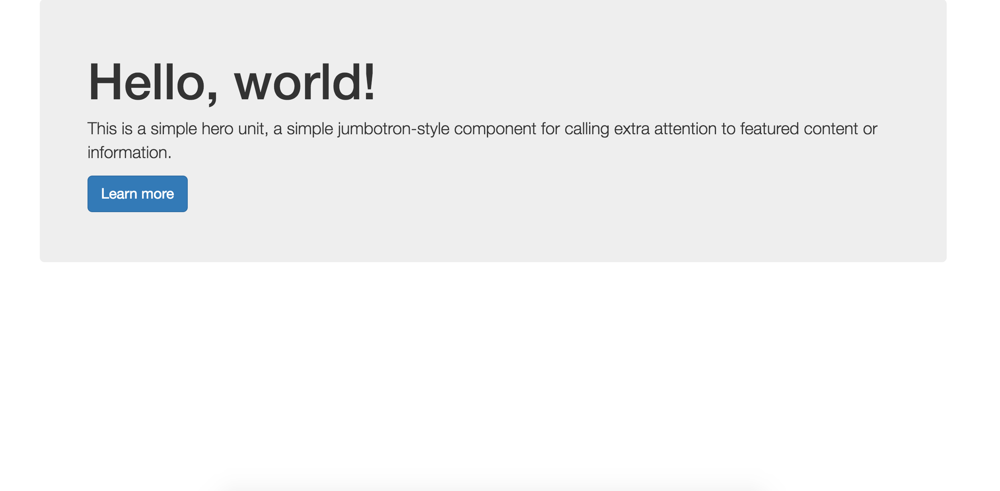

# Bootstrap Exercises

1. Setup a new folder in your Projects directory to mark the start of your new project. It should have the following:

  * `index.html`
  *  `/css` directory
  * `/images` directory
2. In `index.html`, setup your html page with `<html>` tags. Use the Bootstrap CDN to link the Bootstrap CSS to your page. This will use a `Content Delivery Network` to serve your Bootstrap CSS.
```html
<!-- Latest compiled and minified CSS -->
<link rel="stylesheet" href="https://maxcdn.bootstrapcdn.com/bootstrap/3.3.6/css/bootstrap.min.css" integrity="sha384-1q8mTJOASx8j1Au+a5WDVnPi2lkFfwwEAa8hDDdjZlpLegxhjVME1fgjWPGmkzs7" crossorigin="anonymous">
```
Using CDNs can be useful when your application is in production on a server but when working on your computer, it usually makes sense to download the files and link to them directly.

3. Let's [download Bootstrap](http://getbootstrap.com/getting-started/)'s CSS and add it to our folder. Click on `Download Bootstrap` and it will give you a zip file with `/css`, `/fonts`, and `/js` folders inside.

  Move the files inside of `/css` into our own `/css` folder that we created above. Move the `/fonts` and `/js` folders into your project directory so that they are at the same directory level (siblings) as the `/css` folder. You should now have the following in your project directory:

  * `index.html`
  * `/css` directory with bootstrap css
  * `/js` directory with bootstrap javascript
  * `/fonts` directory with bootstrap fonts
  * `/images` directory

4. Now that we have moved our files into our project and organized them in an orderly fashion, we can change our `<link>` tag above to point to your local versions. Bootstrap provides you with a few versions of the CSS. Let's use the minified version of it: `bootstrap.min.css`

  ```html
  <link rel="stylesheet" href="css/bootstrap.min.css" media="screen" charset="utf-8">
  ```
  When you use third-party css and javascript, they sometimes include **minified** versions of it. This means that they have decreased the file size through a process called minification. You can open `bootstrap.min.css` and `bootstrap.css` in your editor to see the difference.

5. Now we should have Bootstrap loaded! Make sure you have built out your `index.html` to include the boilerplate HTML that every page requires: `doctype`, `html`, `head`, `title`, and `body`.

6. To test that Bootstrap is working properly, let's add some content to our body.
```html
<div class = "container">
  <div class="jumbotron">
    <h1>Hello, world!</h1>
    <p>This is a simple hero unit, a simple jumbotron-style component for calling extra attention to featured content or information.</p>
    <p><a class="btn btn-primary btn-lg" href="#" role="button">Learn more</a></p>
  </div>
</div>
```

  If Bootstrap is properly linked, you should see this:

  

7. Check out examples of what can be done with Bootstrap. [These examples](http://getbootstrap.com/getting-started/#examples) help to get you started with how Bootstrap works. Next we will cover how to use some of the more important aspects of Bootstrap.

## The Grid

Working with a grid is extremely useful when building a website or application. Just about every CSS framework includes a grid to work with. Bootstrap lets you use their built-in grid and eventually customize the grid as you get more confident with it.

Learning to read documentation is a very important part of being a web developer. Check out the documentation for the Bootstrap Grid at [http://getbootstrap.com/css/#grid](http://getbootstrap.com/css/#grid)  and you can view examples of the grid at [http://getbootstrap.com/examples/grid/](http://getbootstrap.com/examples/grid/).

The grid makes use of both rows and columns. To work with the grid, you must first create a container. We did this above with the jumbotron example but let's go ahead and delete the jumbotron. There are two kinds of container classes: `.container` (fixed-width) and `.container-fluid` (full-width). You can play around with both of these later by changing the class on the container div.

```html
<div class = "container">
  <!-- grid & content to go here -->
</div>
```

Once you've created the container, you will create rows and columns. Rows are defined with the `.row` class.

```html
<div class = "container">
  <div class = "row">
    <!-- grid columns & content to go here -->
  </div>
</div>
```

Columns can be created a number of ways depending on how large you want them to be, how many columns you want to create and which devices you'd like to target. The Bootstrap grid is **based on a 12 column grid**. For now, we will look at desktop and use `.col-md-X` where `X` is a number of columns your div will cover. If you wanted to have two div columns next to one another, you would use two divs with the class `.col-md-6`. You can mix and match these as long as they add up to 12.

Notice that you do not have to deal with any floats or clearing to make this work.

##### Splitting up a row into halves
```html
<div class = "container">
  <div class = "row">
    <div class = "col-md-6">
      Left half
    </div>
    <div class = "col-md-6">
      Right half
    </div>
  </div>
</div>
```

##### Splitting up a row into thirds

```html
<div class = "container">
  <div class = "row">
    <div class = "col-md-4">
      Left third
    </div>
    <div class = "col-md-4">
      Middle third
    </div>
    <div class = "col-md-4">
      Right third
    </div>
  </div>
</div>
```

## Adding your own stylesheet
Now that you have added Bootstrap to your project, let's add our own stylesheet. You have direct access to the `bootstrap.css` and `bootstrap.min.css` but you **_should never change these files_**. We will instead create our own stylesheet and override the properties we'd like to change.

1. Create a new stylesheet in `/css` and give it a name. I'm going to use `myprofile.css`.
2. Link your new stylesheet in your html file but make sure that it is linked **after** you link Bootstrap's CSS file.
  ```html
  <link rel="stylesheet" href="css/myprofile.css" media="screen" charset="utf-8">
  ```
3. Now you can override styles or colors of your own inside of your own stylesheet.

For example, let's change the background-color of the jumbotron to be blue and change the text color to white.

```css
.jumbotron {
  background-color: #1167BD;
  color: white;
}
```

This style will be loaded after Bootstrap's styling and will override the colors of the jumbotron.
